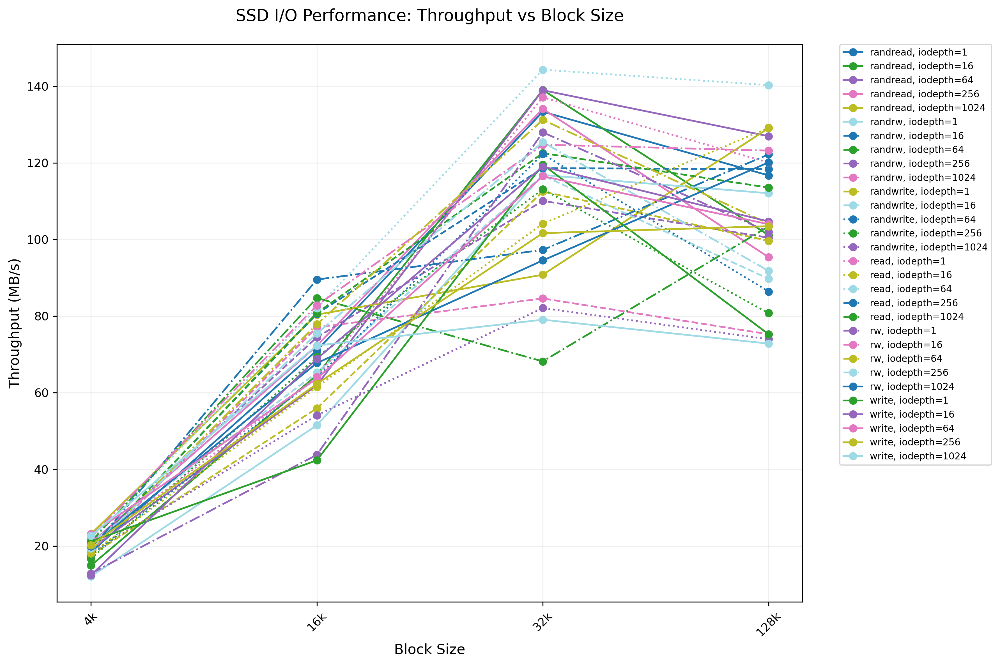
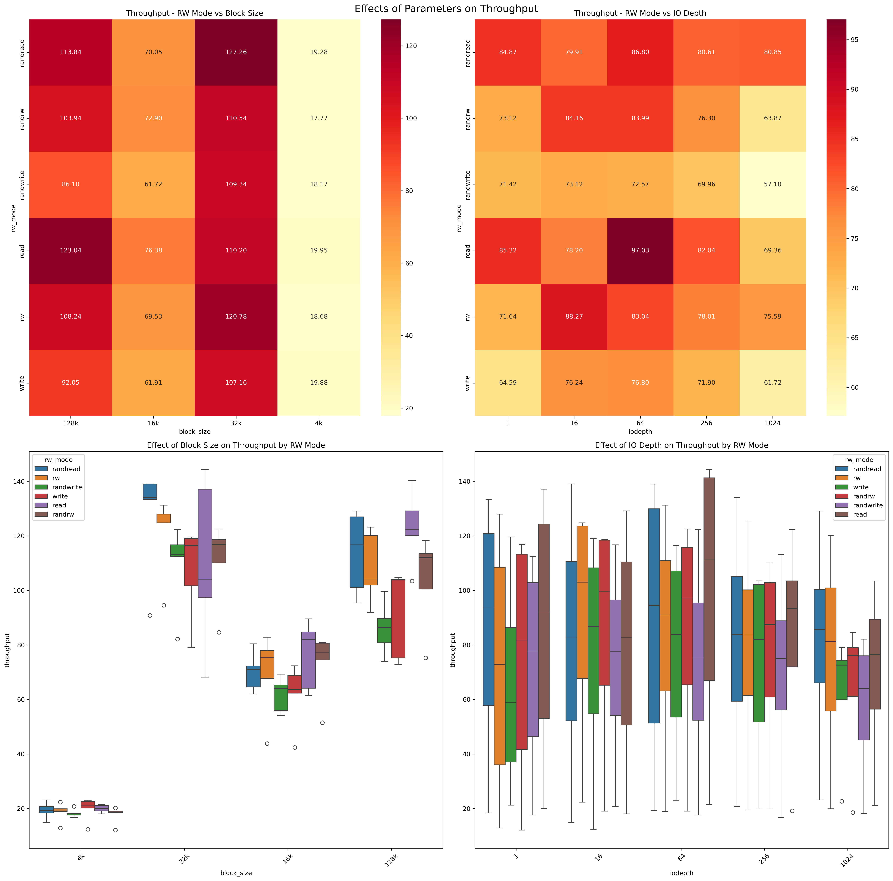
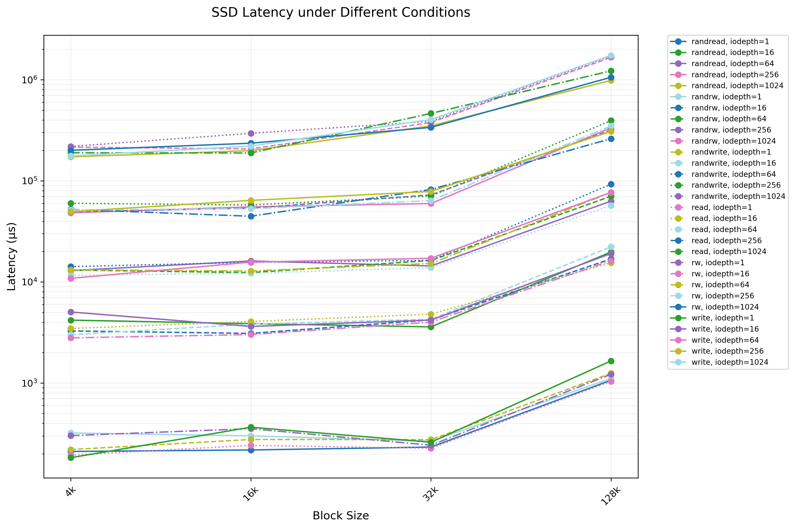
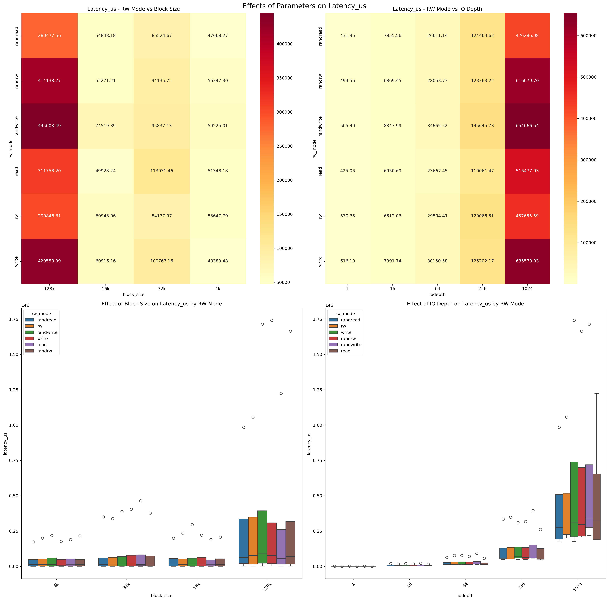
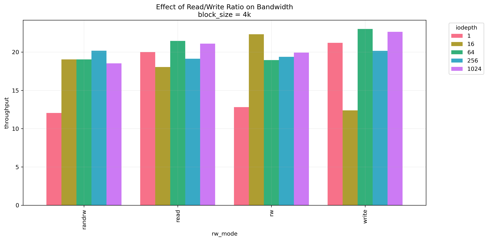
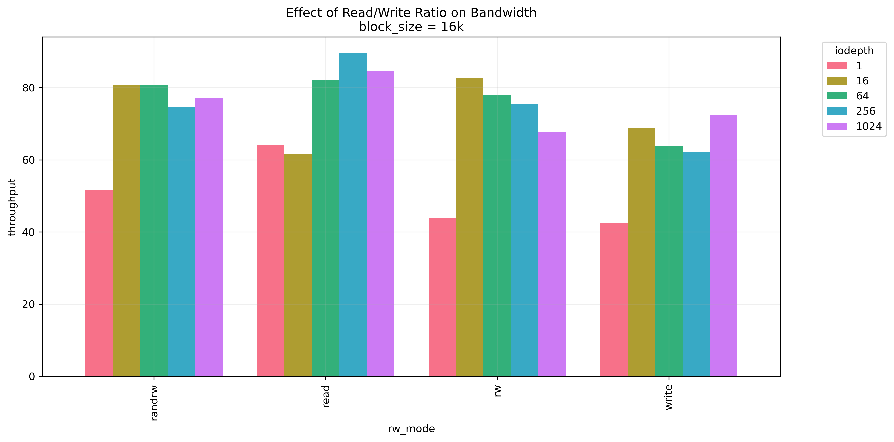
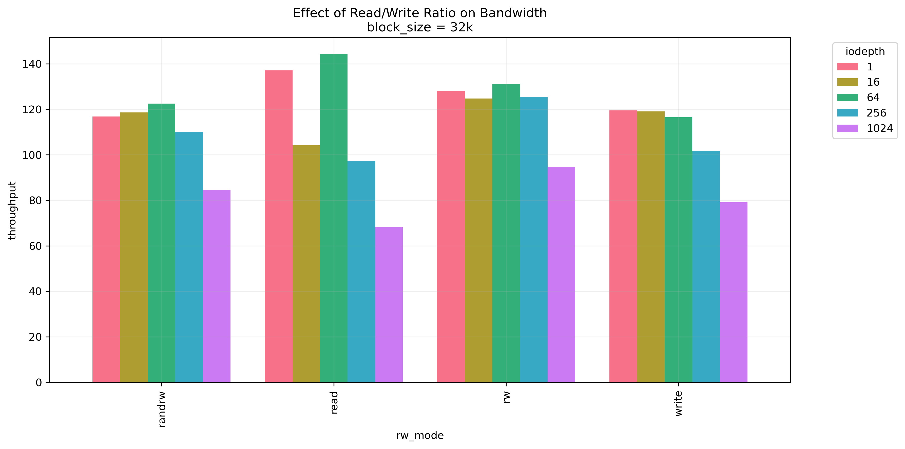
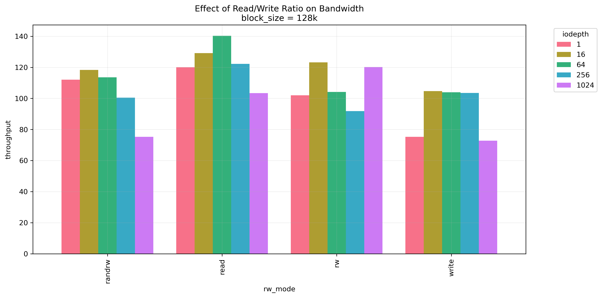

# SSD-Performance-Profiling

This project serves as a comprehensive tool for profiling and analyzing the performance of modern Solid State Drives (SSDs). It focuses on measuring and understanding two critical performance metrics: latency and throughput, under a variety of operating conditions.

## Project Overview

The core of this project utilizes the Flexible IO Tester (FIO), an industry-standard tool widely employed for benchmarking storage devices. FIO allows us to simulate diverse workloads and access patterns, providing insights into how SSDs perform under different scenarios.

Key aspects of the project include:

1. **Performance Metrics**: 
   - Latency: Measures the time taken for a single I/O operation.
   - Throughput: Quantifies the amount of data transferred per unit time.

2. **Variable Parameters**:
   - Access Patterns: Sequential vs. Random access
   - Data Sizes: Ranging from small (e.g., 4KB) to large (e.g., 128KB) block sizes
   - Read/Write Ratios: Various combinations of read and write operations
   - Queue Depths: Simulating different levels of concurrent I/O requests

3. **Analysis and Documentation**: 
   This repository not only provides the tools and instructions for conducting SSD performance tests but also includes a detailed analysis of a sample SSD. This analysis serves as an example of how to interpret and present the results of your benchmarking efforts.

4. **Comparative Study**: 
   The project encourages comparing your results with industry-standard SSDs, such as the Intel Data Center NVMe SSD D7-P5600, to provide context and insights into the relative performance of different SSD models.

## Table of Contents

1. [Creating a new partition in disk via Windows Command Prompt](#creating-a-new-partition-in-disk-via-windows-command-prompt)
2. [Creating a new partition for Linux machine](#creating-a-new-partition-for-linux-machine)
3. [Dependencies](#dependencies)
4. [Experimental Setup](#experimental-setup)
5. [Running Experiments](#running-experiments)
6. [Data Analysis](#data-analysis)
7. [Reporting Results](#reporting-results)
8. [Comparison with Enterprise-Grade SSD](#comparison-with-enterprise-grade-ssd)

## Creating a new partition in disk via Windows Command Prompt

Follow these steps to create a new partition on your disk using the Command Prompt as an administrator.

### Step 1: Open Command Prompt as Administrator

1. Press `Win + X` and select **Command Prompt (Admin)**.

### Step 2: Start DiskPart

In the Command Prompt, type:
```cmd
diskpart
```

### Step 3: List Disks

To view all disks available on your system, run:
```cmd
list disk
```

### Step 4: Select the Disk

Choose the disk you want to work with. For example, select disk 0:
```cmd
select disk 0
```

### Step 5: List Volumes

Next, list all volumes on the selected disk:
```cmd
list volume
```

### Step 6: Select the Volume to Shrink

Pick the volume you wish to shrink. For example, to select volume 0:
```cmd
select volume 0
```

### Step 7: Shrink the Volume by 1024 MB (can be bigger if you want to make a bigger partition)

Shrink the selected volume by 1024 MB using the command:
```cmd
shrink desired=1024
```

### Step 8: Create a New Partition

After shrinking the volume, create a new primary partition of 1024 MB:
```cmd
create partition primary size=1024
```

### Step 9: Format the New Partition

Format the newly created partition with the NTFS file system:
```cmd
format fs=ntfs quick
```

### Step 10: Assign a Drive Letter

Assign a drive letter to the new partition. For example, assign it the letter `E`:
```cmd
assign letter=E
```

### Step 11: Exit DiskPart

Once all operations are complete, exit diskpart:
```cmd
exit
```

## Creating a new partition in Linux

If you're using a Linux system, follow these steps to create a new partition:

### Step 1: Identify Your Drive

List all drives on your system:
```bash
lsblk
```
or
```bash
sudo fdisk -l
```

### Step 2: Launch Partition Tool

Use fdisk to create the partition (replace sdX with your drive letter, e.g., sda):
```bash
sudo fdisk /dev/sdX
```

### Step 3: Create New Partition

In the fdisk prompt:
1. Type `n` to create a new partition
2. Select `p` for primary partition
3. Choose partition number (default: 1)
4. Enter starting sector (default: press Enter)
5. Enter size (e.g., `+1G` for 1GB partition)
6. Type `w` to write changes and exit

### Step 4: Format the Partition

Format the new partition with the ext4 filesystem:
```bash
sudo mkfs.ext4 /dev/sdX1
```

### Step 5: Create Mount Point

Create a directory to mount the partition:
```bash
sudo mkdir /mnt/testdrive
```

### Step 6: Mount the Partition

Mount the new partition:
```bash
sudo mount /dev/sdX1 /mnt/testdrive
```

### Step 7: Set Permissions

Allow user access to the mounted partition:
```bash
sudo chown $USER:$USER /mnt/testdrive
```

> **Note:** Replace sdX with your actual drive designation (e.g., sda, sdb). Be extremely careful to select the correct drive to avoid data loss.


## Dependencies

FIO (Flexible I/O Tester) is the main tool we'll use for benchmarking. Additionally, we'll use Python for data analysis and plotting. Follow these steps to set up the environment:

### Installing FIO

#### On Windows:

1. Download the latest Windows binary from the [FIO GitHub releases page](https://github.com/axboe/fio/releases).
2. Extract the zip file to a directory of your choice.
3. Add the directory containing the FIO executable to your system's PATH.

#### On Linux:

Most Linux distributions have FIO in their package repositories. You can install it using your package manager:

For Ubuntu/Debian:
```bash
sudo apt-get update
sudo apt-get install fio
```

For CentOS/RHEL:
```bash
sudo yum install fio
```

#### Verifying Installation

To verify that FIO is installed correctly, open a terminal or command prompt and run:
```
fio --version
```

This should display the version of FIO installed on your system.

### Python Dependencies

Ensure you have Python 3 installed on your system. You'll also need the following Python libraries:
- matplotlib
- numpy
- pandas

You can install these libraries using pip:

```bash
pip3 install matplotlib numpy pandas seaborn
```

## Experimental Setup

We'll be measuring SSD performance under different combinations of the following parameters:

1. Data access size: 4KB, 16KB, 32KB, 128KB
2. Read vs. write intensity ratio: read, write, randread, randwrite, rw, randrw
3. I/O queue depth: 1, 16, 64, 256, 1024

## Running Experiments

We use a bash script to automate the process of running multiple FIO tests with different parameters. Here's an overview of the script:

```bash
#!/bin/bash
# Create an output directory for FIO results
mkdir -p fio_results

# Arrays of parameters to test
block_sizes=("4k" "16k" "32k" "128k")
io_depths=(1 16 64 256 1024)
rw_modes=("read" "write" "randread" "randwrite" "rw" "randrw")

# Test file and size
test_file="/mnt/e/testfile"
test_size="500M"

# Loop through parameters and run FIO tests
for bs in "${block_sizes[@]}"; do
  for iodepth in "${io_depths[@]}"; do
    for rw in "${rw_modes[@]}"; do
      output_file="fio_results/fio_${rw}_${bs}_iodepth_${iodepth}.json"
      fio --name=benchmark_test --filename=${test_file} --size=${test_size} \
          --rw=${rw} --bs=${bs} --iodepth=${iodepth} --ioengine=libaio --direct=1 \
          --numjobs=1 --runtime=60 --time_based --group_reporting \
          --output-format=json --output=${output_file}
      echo "Finished ${rw} with block size ${bs} and iodepth ${iodepth}"
    done
  done
done

# Run data analysis
python3 plotfio.py
```

To run the experiments:
Run the script: `./fio_test.sh`


> **Note:** Ensure that the `test_file` path in the script points to your dedicated test partition before running. Here, it points to the partition I created and labeled as my E drive. Writing to the wrong partition CAN result in data loss.
> 
> - Running this script will take several hours.

## Data Analysis

After running the experiments, the script automatically calls a Python script (`plotfio.py`) to analyze the JSON output files and generate plots. This script extracts the relevant performance metrics:

- For latency: It uses the `clat_ns` (completion latency) or `lat_ns` (total latency) fields.
- For throughput: It uses the `iops` (IO operations per second) field for small access sizes, and the `bw` (bandwidth in KB/s) field for large access sizes.

The Python script creates various plots to visualize the relationships between different parameters and performance metrics.

## Reporting Results

The experiments revealed several key insights into SSD performance characteristics across various parameters:

### Throughput

<p align="center">
  
</p>

1. Block Size Impact: 
   - As shown in the graph, throughput generally increases with larger block sizes, with a significant jump observed between 16K and 32K block sizes.
   - For most operations, peak throughput is achieved at 32K block size, with a slight decrease or plateau at 128K.

2. I/O Queue Depth:
   - The graph illustrates that higher queue depths (represented by different line colors) generally result in increased throughput, especially for random read operations.
   - The impact of queue depth varies depending on the operation type and block size, as evident from the spread of lines for each operation type.
   - For some operations, particularly writes, very high queue depths (1024) can lead to decreased throughput at larger block sizes.

3. Operation Type:
   - Sequential operations (read, write) consistently show higher throughput compared to their random counterparts (randread, randwrite), as seen in the higher positioning of these lines on the graph.
   - Read operations (solid lines) generally outperform write operations (dotted lines) in terms of throughput across all block sizes.

4. Mixed Workloads:
   - Mixed read/write workloads (rw, randrw) show throughput levels between pure read and pure write operations, often closer to write performance, as indicated by their position in the middle of the graph.

<p align="center">
  
</p>

This comprehensive set of graphs further illustrates the effects of various parameters on SSD throughput:

1. Block Size Impact (Top-left heatmap and bottom-left box plot):
   - The heatmap clearly shows that larger block sizes (32K and 128K) generally result in higher throughput across different R/W modes.
   - The box plot confirms this trend, showing a significant increase in throughput as block size increases, especially from 4K to 32K.

2. I/O Queue Depth (Top-right heatmap and bottom-right box plot):
   - The heatmap demonstrates that increasing I/O depth generally improves throughput, with the highest values often seen at depths of 64 or 256.
   - The box plot reveals that the benefit of increased queue depth varies by operation type, with some operations (e.g., randread) showing more dramatic improvements than others.

3. Operation Type Differences:
   - Both heatmaps and box plots consistently show that sequential operations (read, write) outperform their random counterparts (randread, randwrite).
   - Read operations tend to achieve higher throughput than write operations across various block sizes and queue depths.

4. Variability in Performance:
   - The box plots illustrate the range of throughput values for each condition, showing that some operations (e.g., randread) have higher variability in performance compared to others.

5. Optimal Configurations:
   - The heatmaps suggest that the best throughput is often achieved with larger block sizes (32K or 128K) and moderate to high queue depths (64-256), but this can vary depending on the specific operation type.

These visualizations provide a more specific understanding of how different parameters interact to affect SSD throughput, complementing the insights from the previous graph.

### Latency

<p align="center">
  
</p>

The graph above illustrates the complex relationships between latency, block size, and I/O queue depth across different operation types:

1. Block Size Correlation:
   - The graph shows a clear exponential increase in latency as block size increases, particularly dramatic at 128K.
   - All operation types follow a similar trend, with relatively stable latency up to 32K block size, followed by a sharp increase.
   - The log-scale y-axis demonstrates that the latency increase from 32K to 128K is several orders of magnitude.

2. Queue Depth Impact:
   - Higher queue depths (represented by different line styles) consistently result in higher latency across all block sizes.
   - The separation between queue depth lines becomes more pronounced at larger block sizes.
   - Operations with queue depth of 1024 (shown in the uppermost lines) consistently show the highest latency.
   - The effect is particularly visible in the 10^5 to 10^6 microsecond range.

3. Operation Type Differences:
   - Random operations (randread, randwrite) consistently show higher latency compared to sequential operations (read, write).
   - Write operations (dotted lines) generally exhibit higher latency than read operations (solid lines).
   - The performance gap between different operation types widens with increasing block size.
   - Sequential reads at low queue depths maintain the lowest latency across all block sizes.

4. Latency Distribution:
   - The graph shows distinct clustering of operation types and queue depths.
   - Lower queue depth operations (1-16) tend to cluster together at the bottom of the graph.
   - Higher queue depths (256-1024) form distinct clusters at higher latency levels.
   - The spread between different operation types becomes more pronounced as block size increases.

These findings demonstrate the critical trade-offs between block size, queue depth, and operation type when optimizing for latency. The exponential increase in latency at larger block sizes suggests that applications requiring low latency should carefully consider their block size choices, particularly when operating with high queue depths.

<p align="center">
  
</p>

The heatmaps and box plots above provide additional insights into latency patterns:

1. Block Size Impact (Top-left heatmap and bottom-left box plot):
   - The heatmap reveals distinct latency patterns across block sizes, with darker colors indicating higher latency.
   - The box plot shows a relatively stable latency for smaller block sizes (4K-32K), with a significant increase at 128K.
   - Outliers (shown as dots) indicate occasional latency spikes, particularly at larger block sizes.

2. I/O Queue Depth Effects (Top-right heatmap and bottom-right box plot):
   - The heatmap shows a clear increase in latency with higher queue depths, particularly noticeable at depths of 256 and 1024.
   - The box plot demonstrates increased latency variability at higher queue depths.
   - The relationship between queue depth and latency appears to be non-linear, with dramatic increases at the highest depths.

3. Operation Type Analysis:
   - Both visualizations confirm that random operations experience higher latency compared to sequential ones.
   - Write operations consistently show higher latency than read operations across all configurations.
   - Mixed operations (rw, randrw) typically show latency values between pure read and pure write operations.

4. Statistical Distribution:
   - The box plots reveal the spread of latency values, showing both typical performance and outliers.
   - Higher queue depths not only increase median latency but also lead to greater variability in performance.
   - Some operations show more consistent performance (smaller boxes) while others show more variability (larger boxes).

These visualizations complement the line graph by providing:
- A clear view of the relative impact of different parameters through color coding
- Statistical distribution of latency values through box plots
- Identification of outliers and extreme cases
- Clearer visualization of the relationships between operation types, block sizes, and queue depths

### Read/Write Ratio Effects

The following analysis examines bandwidth performance across different block sizes and I/O configurations:

#### 4K Block Size Analysis
<p align="center">
  
</p>

- Limited bandwidth (maximum 20-25 MB/s)
- Minimal performance variation between operation types
- Limited sensitivity to queue depth changes

#### 16K Block Size Analysis
<p align="center">
  
</p>

- Increased bandwidth (80-90 MB/s)
- Read operations begin outperforming writes
- Higher queue depths (64-256) show performance benefits

#### 32K Block Size Analysis
<p align="center">
  
</p>

- Significant bandwidth increase (120-140 MB/s)
- Optimal performance at queue depth 64
- Performance degradation starts at highest queue depths

#### 128K Block Size Analysis
<p align="center">
  
</p>

- Peak bandwidth (up to 140 MB/s)
- Pronounced queue depth impact
- Linear scaling for write operations
- Significant degradation at queue depth 1024

#### Key Performance Patterns

1. Block Size Impact:
   - Bandwidth increases with block size but incurs higher latency
   - Performance differences between operation types become more pronounced
   - Larger blocks show greater sensitivity to queue depth

2. Operational Characteristics:
   - Sequential operations outperform random operations
   - Read operations show increasing advantage over writes at larger block sizes
   - Mixed workloads perform intermediately between pure read and write operations

3. Queue Depth Considerations:
   - Optimal queue depth varies by block size and operation type
   - Higher queue depths benefit random read operations most
   - Excessive queue depths (1024) often degrade performance

These findings indicate that optimal SSD performance requires careful tuning of block size and queue depth based on the specific workload characteristics. Sequential reads with moderate queue depths typically provide the best performance, while random operations and extremely high queue depths should be minimized when possible.

### Comparison with Enterprise-Grade SSD

To provide context for our results, let's compare them with the Intel Data Center NVMe SSD D7-P5600 (1.6TB), a high-end enterprise storage solution.

#### Performance Comparison

The Intel D7-P5600 specifications list:
- Random write-only 4KB IOPS: 130K
- Enterprise-grade reliability and endurance
- Consistent performance under sustained workloads

Our test results show:
- Lower raw IOPS performance compared to the enterprise SSD
- More variable performance under different queue depths
- Significant performance degradation at higher queue depths

#### Understanding the Differences

Several factors explain the performance characteristics we observed:

1. Optimization Targets:
   - Enterprise SSDs prioritize consistent performance and reliability
   - Consumer SSDs optimize for burst performance and cost-effectiveness
   - Our testing reveals performance variations that would be less pronounced in enterprise drives

2. Hardware Architecture:
   - Enterprise drives use higher-grade NAND flash
   - More sophisticated controllers manage operations
   - Additional power loss protection circuits affect performance
   - Over-provisioning ensures consistent write performance

3. Use Case Considerations:
   - Enterprise SSDs are designed for:
     - 24/7 operation
     - Consistent workloads
     - Mixed read/write patterns
     - High queue depth scenarios
   - Consumer SSDs optimize for:
     - Burst operations
     - Lower queue depths
     - Cost-effective performance
     - Typical desktop/laptop workloads

4. Performance Stability:
   - Our results show performance degradation at high queue depths
   - Enterprise SSDs maintain more consistent performance
   - This reflects different design priorities between consumer and enterprise drives

This comparison highlights how different SSD classes target specific use cases and workloads, with enterprise drives focusing on consistency and endurance while consumer drives prioritize cost-effective performance for typical workloads.

